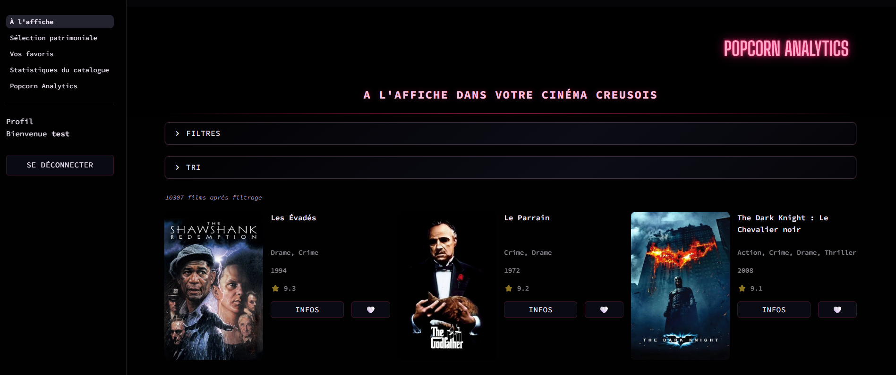
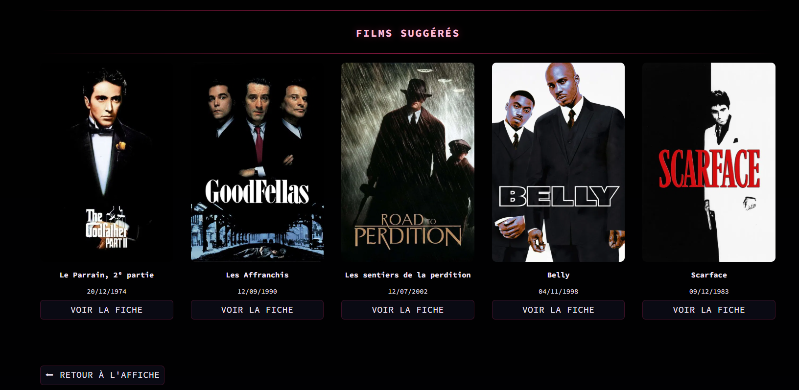
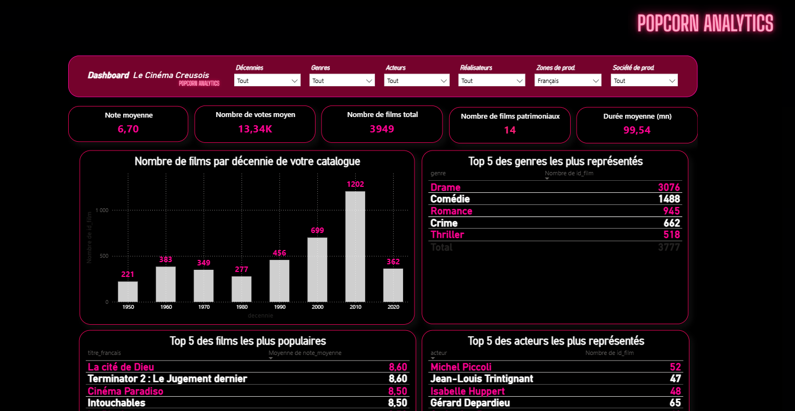

# Cine Creusois - Popcorn Analytics

Application de catalogue et de recommandation de films pour le Cinema Creusois, developpee avec Streamlit et FastAPI.

---

## Aperçu de l'application

### Page de connexion


### Catalogue des films



### Recommandations de films



### Dashboard Popcorn Analytics




---

## Description du projet

Ce projet propose une plateforme interactive permettant de :

- **Explorer** un catalogue de plus de 10 000 films avec filtres (genre, annee, note, zone de production) et pagination
- **Decouvrir** une selection patrimoniale de films classiques
- **Consulter** la fiche detaillee de chaque film (synopsis, casting, note, affiche)
- **Obtenir des recommandations** personnalisees grace a un moteur de suggestion base sur le Machine Learning (KNN)
- **Gerer ses favoris** (utilisateurs connectes)
- **Visualiser des statistiques** sur le catalogue

---

## Architecture

Le projet suit une architecture front/back separee :

```
Projet2/
|-- app/
|   |-- app.py                  # Point entree Streamlit
|   |-- auth.py                 # Authentification (login/logout)
|   |-- style.css               # Theme cyberpunk neon rose
|   |-- assets/                 # Logo et images
|   |-- pages/
|       |-- 1_a_l_affiche.py          # Catalogue principal
|       |-- 2_selection_patrimoniale.py # Films patrimoniaux
|       |-- 3_vos_favoris.py           # Favoris utilisateur
|       |-- 4_statistiques_du_catalogue.py # Statistiques / KPIs
|       |-- 5_popcorn_analytics.py     # Analytics avances
|       |-- Noussuggestions.py         # Fiche film + recommandations ML
|-- api.py                      # API FastAPI (backend)
|-- data/
|   |-- processed/
|       |-- movies_fr_final.parquet    # Dataset principal
|       |-- knn_df_encoded.parquet     # Dataset encode pour le KNN
|-- requirements.txt
|-- README.md
```

### Frontend - Streamlit

Interface utilisateur avec un theme cyberpunk (fond noir, neon rose). Les pages permettent la navigation, le filtrage, la recherche et affichage des recommandations.

### Backend - FastAPI

API REST qui charge les donnees une seule fois au demarrage et expose les endpoints suivants :

| Endpoint | Methode | Description |
|----------|---------|-------------|
| `/` | GET | Message de bienvenue + nombre total de films |
| `/films/` | GET | Liste paginee avec tri (skip, limit, sort_by) |
| `/films/search/?q=...` | GET | Recherche par titre, realisateur ou acteur |
| `/films/{film_id}` | GET | Details complets d un film |
| `/films/{film_id}/recommendations?k=5` | GET | Top K films similaires (KNN) |
| `/films/patrimonial/` | GET | Films de la selection patrimoniale |
| `/stats/` | GET | Statistiques globales du catalogue |

---

## Moteur de recommandation


Le systeme de recommandation utilise un modele **K-Nearest Neighbors (KNN)** avec **similarite cosinus**.

Afin d'ameliorer la pertinence des suggestions, plusieurs types de features ont ete combines.

### Enrichissement des donnees

Les donnees ont ete enrichies avec les **keywords TMDB** recuperes via l'API TheMovieDB.

Ces mots-cles decrivent les themes, concepts ou elements narratifs importants d un film (ex : *dream, heist, time travel, dystopia*).

Ils permettent d'ameliorer fortement la detection de films similaires sur le plan narratif.

### Features utilisees

Les films sont representes par un vecteur de features combinees :

| Feature | Methode | Description |
|-------|--------|-------------|
| **Synopsis** | TF-IDF | Representation vectorielle du synopsis pour capturer la proximite thematique |
| **Keywords TMDB** | TF-IDF | Representation vectorielle des mots-cles narratifs recuperes via l API TMDB |
| **Genres** | MultiLabelBinarizer | Encodage multi-hot des genres d un film |
| **Decennie** | One-hot encoding | Proximite temporelle entre films |
| **Langue originale** | One-hot encoding | Proximite culturelle |
| **Zone de production** | One-hot encoding | Proximite geographique |
| **Nombre de votes** | Log-scaled | Indicateur de popularite |

Les representations textuelles (**synopsis + keywords**) sont vectorisees avec **TF-IDF (Term Frequency - Inverse Document Frequency)** afin de mesurer la similarite semantique entre films.

### Modele de recommandation

Les vecteurs de features sont concaténés dans une **matrice sparse** optimisee pour la performance.

Le modele utilise :

- **KNN (NearestNeighbors - Scikit-learn)**
- **Distance cosinus**

Le modele identifie les **films les plus proches dans l espace des features**.

### Re-ranking par popularite

Un score hybride est applique pour ameliorer la qualite des recommandations :
score_final = 0.75 × similarite + 0.25 × popularite
Ce mecanisme permet de recommander des films :

- **thematiquement proches**
- **suffisamment populaires ou reconnus**
---

## Installation

### Prerequis

- Python 3.10+
- pip ou conda

### Etapes

1. **Cloner le projet**
```bash
git clone <url-du-repo>
cd Projet2
```

2. **Installer les dependances**
```bash
pip install -r requirements.txt
```

3. **Verifier les donnees**

Les fichiers Parquet doivent etre presents dans `data/processed/` :
- `movies_fr_final.parquet`
- `knn_df_encoded.parquet`

---

## Lancement

### Streamlit (frontend)

```bash
cd app
streamlit run app.py
```

Application accessible sur `http://localhost:8501`

### FastAPI (backend - optionnel)

```bash
uvicorn api:app --reload
```

API accessible sur `http://127.0.0.1:8000`

Documentation interactive Swagger sur `http://127.0.0.1:8000/docs`

---

## Technologies utilisees

| Technologie | Usage |
|-------------|-------|
| **Streamlit** | Interface utilisateur interactive |
| **FastAPI** | API REST backend |
| **Pandas / PyArrow** | Manipulation de donnees, format Parquet |
| **Scikit-learn** | Modele KNN, TF-IDF, preprocessing |
| **SciPy** | Matrices creuses pour le KNN |
| **TMDB API** | Recuperation des keywords narratifs des films |
| **Deep Translator** | Traduction automatique des synopsis |
---

## Equipe

Projet realise dans le cadre de la formation Data Analyst.

---

## Licence

Projet academique - usage educatif uniquement.